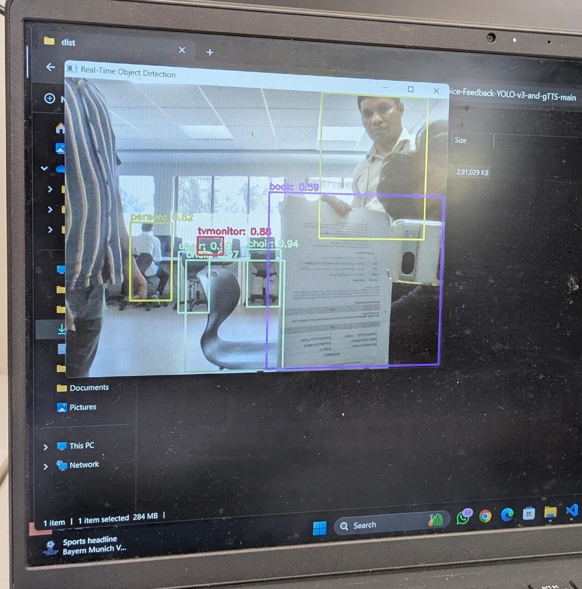

# Object-Detection-with-Voice-Feedback-YOLO-v3-and-gTTS

## 🖼️ Demo Screenshots

  

---

## 🎬 Screen Recording (Demo)

  

 
 

Object Detection is a field of Computer Vision that detects instances of semantic objects in images/videos (by creating bounding boxes around them in our case).
We can then convert the annotated text into voice responses and give the basic positions of the objects in the person/camera’s view.

 

## A very high-level overview

 

 

 

 

1. **Training Data**: The model is trained with the [Common Objects In Context](https://cocodataset.org/#explore) (COCO) dataset. You can explore the images that they
labeled in the link, it’s pretty cool.

2. **Model**: The model here is the You Only Look Once (YOLO) algorithm that runs through a variation of an extremely complex Convolutional Neural Network architecture 
called the Darknet. We are using a more enhanced and complex YOLO v3 model. Also, the python cv2 package has a method to setup Darknet from our configurations in the yolov3.cfg file. COCO has already been trained on YOLO v3 by others, so I will be using a pre-trained model and we have already obtained the weights stored in a 200+mb file.

3. **Input Data**: We will be using static images and feed them to this trained model.

4. **API**: The class prediction of the objects detected in every image will be a string e.g. “cat”. We will also obtain the coordinates of the objects in the image 
and append the position “top”/“mid”/“bottom” & “left”/“center”/“right” to the class prediction “cat”. We can then send the text description to the Google 
Text-to-Speech API using the gTTS package.

5. **Output**: We will be getting voice feedbacks in the form e.g. “bottom left cat” — meaning a cat was detected on the bottom-left of my camera view using Google Text-to-Speech
API using gTTS package by giving text description of the object.

## Voice Feedback

We can use bx & by relative to W & H to determine the position of the objects detected and send it as a text string to gTTS.

### **Note**:
You need to download the [yolo pretrained weights](https://pjreddie.com/media/files/yolov3.weights) to get started with the code.
